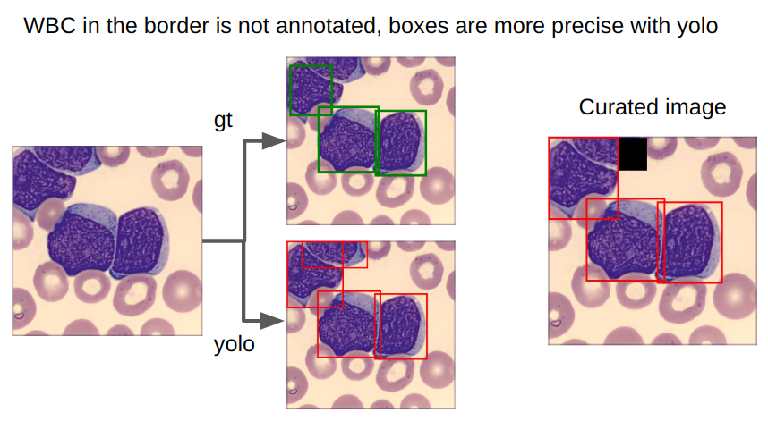
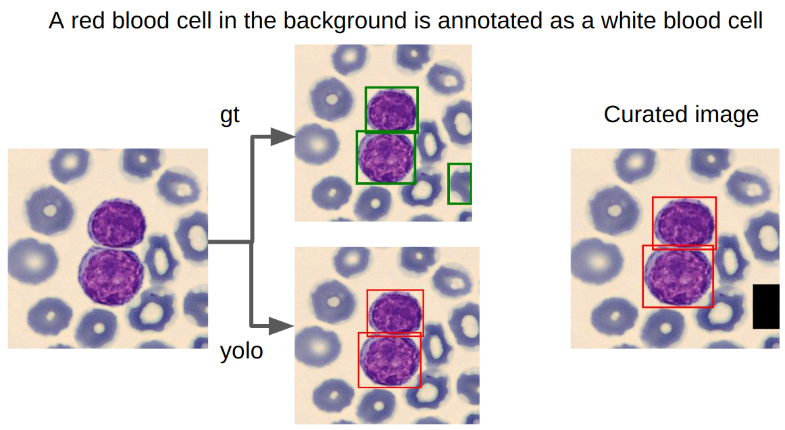
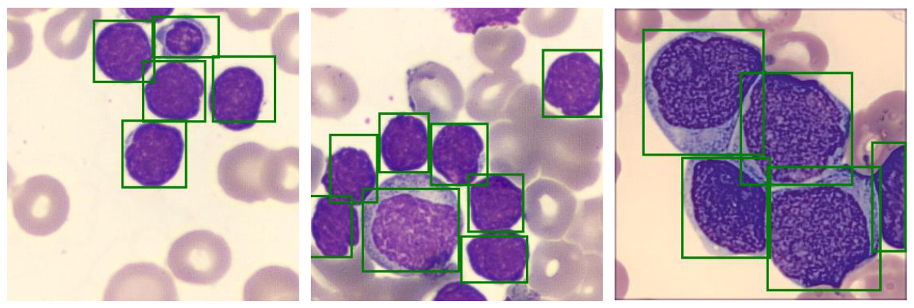
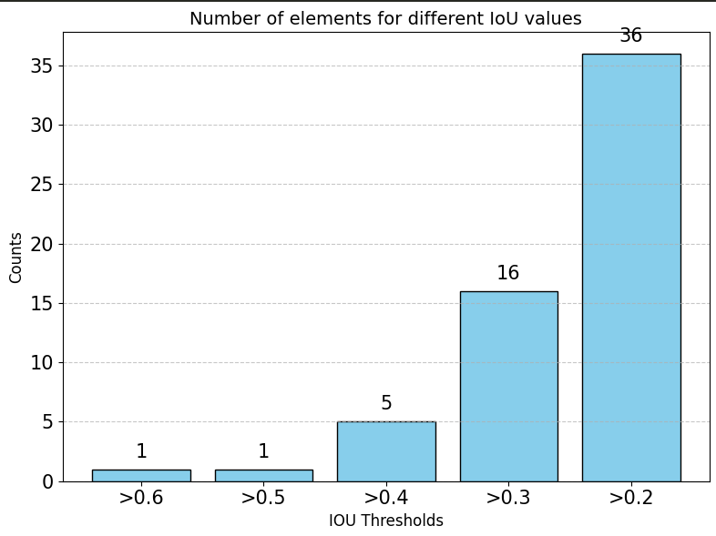
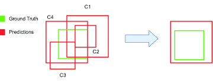

# 🩸 Cytologia : Team VitaDX 🩸

Project used for training and inference for the Cytologia Data Challenge 

The [`inference.ipynb`](inference.ipynb) file resumates our thought process for both inference and training, including details on hyperparameters, augmentations, and other relevant information. While the information in the [`inference.ipynb`](inference.ipynb) file is redundant with this `Readme.md`, it serves as a standalone resource for explaining the method and predicting results.

You can download the best pretrained weights with this link : [Google Drive](https://drive.google.com/drive/folders/1gDwqRtLoKqwLIaGFd2SwPffzibOtIEmx?usp=sharing)

## Getting Started

You will need [Python 3.11](https://www.python.org/downloads) and the packages specified in `requirements.txt`.

Install packages with:

```
pip install -r requirements.txt
```

## Inference

For simple inference on your own image, here is a code snippet :
```python
from detection import YoloInference

yolo_engine=YoloInference("path/to/your/model.pt",device="cuda")
img_path="path/to/your/image"

boxes,scores,labels=yolo_engine.predict(img_path,conf=0.2)
```

For ensembling inference : 
```python
from detection import YoloInference

yolo_engine1=YoloInference("path/to/your/model1.pt",device="cuda")
yolo_engine2=YoloInference("path/to/your/model2.pt",device="cuda")

# You can use an arbitrary number of models for ensembling
ens_engine=EnsembleYolo([yolo_engine1,yolo_engine2],use_probs=True)

img_path="path/to/your/image"

boxes,scores,labels=ens_engine.predict(img_path,conf=0.2)
```

For the label correspondance, we use this dictionnary (alphabetical order):
```python
itos={0:'B', 1:'BA', 2:'EO', 3:'Er', 4:'LAM3', 5:'LF', 6:'LGL', 7:'LH_lyAct', 8:'LLC', 9:'LM', 10:'LY', 11:'LZMG', 12:'LyB', 13:'Lysee', 14:'M', 15:'MBL', 16:'MM', 17:'MO', 18:'MoB', 19:'PM', 20:'PNN', 21:'SS', 22:'Thromb'}
```

## Model Training

### How to train the model ? 

In order to configure the training of the yolo model, you can tweak some training parameters of YoloConfig: 
        
- **dataset** `(str)` : Name of the dataset to use.
- **backbone** `(str)`: Backbone to use (for example "yolo11n.pt" or "yolov10n.pt")
- **epochs** `(int)` : Number of epochs to train the model.
- **batch_size** `(int)` : Batch size for training.
- **workers** `(int)` : Number of workers to use for the dataloader.
- **img_size** `(tuple)` : Image size to use for the model, specified as a tuple (e.g., `(224, 224)`).
- **nc** `(int)` : Number of classes (23 for Cytologia)
- **classes** `(list[str])` : List of classes (names corresponding to the class index)
- **identifier** `(str)` : Identifier for the model (for easy versioning)
- **device** `(str)` : Device to use for training, such as `cuda`, `cpu`, or `mps`.
- **seed** `(int)` : Seed value to ensure reproducibility of experiments.
- **val_split** `(float)` : Validation split to use, for cross validation, this parameter is not used
- **folds** `(int)`: Number of folds for cross validation. If 1, no cross validation is used
- **data_augmentation** `(dict)`: Dictionary of data augmentation parameters ([default ultralytics augmentations](https://docs.ultralytics.com/modes/train/#augmentation-settings-and-hyperparameters))

To train the model, you can use the code in the file [`train_yolo.py`](train_yolo.py) or use the following snippet : 

```python
from detection import YoloConfig, YoloTrainer
from utils import get_device

device=get_device()

classes=['B', 'BA', 'EO', 'Er', 'LAM3', 'LF', 'LGL', 'LH_lyAct', 'LLC', 'LM', 'LY', 'LZMG', 'LyB', 'Lysee', 'M', 'MBL', 'MM', 'MO', 'MoB', 'PM', 'PNN', 'SS', 'Thromb']

conf=YoloConfig(
    dataset="/absolute/path/to/your/dataset",
    backbone="yolo11n.pt",
    img_size=384, # must be a multiple of 32
    identifier="identifier",
    nc=23,
    classes=classes,
    device=device,
    epochs=100,
    batch_size=64,
    seed=42,
    folds=1,
    val_split=0.05,
)
trainer=YoloTrainer(conf)
trainer.train()
```

### Training hyperparameters, augmentations etc ...

To train the model effectively, we tested different settings for the training process. This section will outline our assumptions and the tests we conducted to validate them. Finally, we will describe the final training setup that we used.

**Augmentations**: First, it’s important to note that our baseline for augmentations was the set of default augmentations provided by the Ultralytics library, which are applied when no specific augmentation parameters are set:

- *Mosaic*: This augmentation creates new training images by combining patches from different images into a single mosaic. Mosaic augmentation is disabled during the last 10 epochs of training.

- *HSV* (hue, saturation, and value): These three augmentation techniques affect the hue, saturation, and value of an image. Given that the classification of white blood cells heavily depends on the staining used to color the cells, we initially attempted to disable these transformations. After testing, we kept the default values for saturation and value but set the hue to 0, even though the default hue value was already very small.

- *Geometrical augmentations* (translate, scale, flip): We kept all other default augmentations, as they are primarily geometric and unlikely to hinder the training process in our case.

- *Deactivated transformations*: The transformations that were disabled by default were not modified.

- *MixUp*: Since some classes were very similar to each other, we extensively experimented with the MixUp augmentation to soften the class boundaries. Specifically, we tested different MixUp thresholds and tried stopping it before the end of training. Our experiments showed that MixUp did not improve performance for our specific problem.

**Selection of models** : To enhance model performance, we employed model ensembling as described in the inference section. However, for optimal ensembling, it is crucial to choose models that complement each other. We experimented with various configurations and ultimately chose a mix of different YOLOv11 sizes combined with various YOLOv10 sizes. Since YOLOv11 and YOLOv10 produce similar results but use different methods, our experiments demonstrated that they complement each other well.

**Hyperparameters and training** : We trained all our models for 250 epochs with a batch size of 64 (or 32 for larger models, such as YOLOv11l). We reduced the image size from 640 to 384 and used a validation split of 5% of the data to maximize the amount of data available for training.

## Dataset creation and curation

In order to create the yolo dataset in the correct format, we had to do some formatting to convert the train.csv file to an acceptable yolo format.   
We have also implemented a dataset curation based on a yolo trained on the "not curated" data in order to clean the unprecise bounding box, mask the unatated wbc and mask the wrongly annotated wbc. 

A significant part of our results is due to the training method we employed. As mentioned earlier, we chose YOLO as our backbone model to ensure low inference time while maintaining decent performance.

After visualizing parts of the dataset, we concluded that cleaning the data would improve the convergence and stability of the training process. This decision was driven by several factors:

- White blood cells (WBCs) located at the edges of images are sometimes annotated and sometimes not, which can lead to confusion during training.
- A portion of the dataset contains annotation errors, including misplaced bounding boxes, bounding boxes outside the image, or missing annotations.

The quality of the classification for each cell was not evaluated, as our team lacks the biological expertise to accurately classify cells with certainty. However, such noise in the dataset, if present, could significantly affect performance.

To clean the training dataset, we trained a YOLO model using cross-validation and cleaned the validation data from each fold. This approach ensures that our model does not overfit the training data and can be effectively used for data curation.

The annotations were formatted in the standard YOLO format, and the 5 models (k=5 for our cross-validation) were trained for 250 epochs using the [Ultralytics Library](https://docs.ultralytics.com/models/yolo11/).


After training, we cleaned the dataset as follows:

- For each YOLO model, we predicted bounding boxes and classes on the validation data.

- We matched the ground truth boxes provided in the train.csv with the YOLO predictions, retaining the YOLO bounding boxes (which were empirically more accurate than the manual annotations) while preserving the ground truth class.
- For YOLO detections with a sufficient score that did not match any ground truth boxes, we masked the corresponding part of the image with a black mask to ensure no unannotated cells remained in the training dataset (whether they were WBCs at the border or unannotated WBCs) (see left figure).
- For ground truth boxes with no matching YOLO boxes (IoU < 0.4), we removed these bounding boxes from the dataset, assuming they were incorrect annotations (see right figure).

The figure below illustrates the cleaning procedure we described.

      

**What Didn’t Work ?** : We also experimented with a more aggressive curation process, aiming to mask cells where the ground truth label and the YOLO-predicted label differed significantly. We implemented two approaches for this: soft-labels and hard-labels, intending to remove potential misannotations made by the labelers.

- Hard labels: This approach simply checks if the predicted label matches the ground truth. If not, the corresponding box is masked.
- Soft labels: This method is more lenient, verifying whether the predicted and ground truth labels belong to the same family of cells. The cell families were defined based on input from the AI chatbot of the challenge and other online resources.   

However, both methods led to a decrease in performance. Some cell types were frequently misclassified, resulting in a highly unbalanced dataset that negatively impacted the training process.

The curation and creation script is in the file [`csv_dst_yolo.ipynb`](notebooks/csv_dst_yolo.ipynb) along with functions in [`utils_notebook.py`](notebooks/utils_notebook.py).

## Uncorruption of data

When training on the train images, we encountered an error `Corrupt JPEG data: 27 extraneous bytes before marker 0xdb`. To correct this, we simply reprocessed and saved the images after loading. Details are explained in [`uncorrupt.ipynb`](notebooks/uncorrupt.ipynb).

## Filling the test.csv file 

To correctly create a prediction to submit in the Cytologia Data Challence, we had to fill the test.csv with our detections and labels.

### Yolo Model

We opted for the latest YOLO model from Ultralytics: [YOLO11](https://docs.ultralytics.com/models/yolo11/)  alongside its predecessor [YOLOv10](https://docs.ultralytics.com/models/yolov10/) if you use ensembling. This decision was driven by the models' fast inference capabilities, which meet the challenge's requirement for efficient image processing. By leveraging different models, we aim to take advantage of ensembling diverse architectures to improve overall performance.

We specifically chose relatively small versions of YOLO11 and YOLOv10 to strike a balance between inference speed and accuracy: YOLO11n (size 384), YOLO11m (size 384), and YOLOv10n (size 384). The only exception is YOLOv11x, which is a larger model compared to the others. However, being a YOLO model, its inference speed still remains relatively fast.

All models were fine-tuned using an automated dataset curation process. Details of this process are provided in the training section of the notebook, where we outline our strategy for optimizing YOLO models to achieve the best possible performance.

We used the following models for our best solution :


**Models trained with iou curation**: The models `yolo11m384_iou.pt`,`yolo11x384_iou.pt`,`yolov10s384_iou.pt` and `yolov10m384_iou.pt` were trained on a dataset where ground truth boxes with a low IoU to the predicted ones were masked.    
**Models trained with simple curation**: The models `yolo11m384_blk.pt` and `yolov10n384_blk.pt` were trained on a dataset where ground truth boxes were kept, even if they had a low IoU with the predicted ones.   
**Model not curated**: The `yolo11n384_nc.pt` model was trained on the raw data from the CSV, with only minor corrections made for bounding boxes that were out of the image.

You can download the best pretrained weights with this link : [Google Drive](https://drive.google.com/drive/folders/1gDwqRtLoKqwLIaGFd2SwPffzibOtIEmx?usp=sharing)

### Non-Maximum-Suppression 

The YOLO model from Ultralytics includes its own Non-Maximum Suppression (NMS) algorithm, designed to eliminate overlapping bounding boxes of the same class. We have chosen a relatively low NMS threshold of 0.4, as cells of the same or different classes should not overlap (at least, they do not in the training data).

**Why?** In the context of cytology, one of the goals is to minimize the overlap between cells. After analyzing the dataset, we concluded that overlapping cells are either non-existent or extremely rare.   


  

The standard Ultralytics functions do not return class probabilities for each detection, which is crucial for ensembling. To address this, we modified the inference process. First, we used the underlying Torch model to obtain the predictions in the correct format. Then, we modified the non_max_suppression function from Ultralytics to return the probability vector along with the usual outputs (this is used only for ensembling since we don't need the probabilities for a single model).

Additionally, we handled the image preprocessing ourselves.

Since YOLOv10 is end-to-end, we did not use the class probabilities when ensembling with YOLOv10 models.


### Detection models ensembling

To enhance the performance of our method, we decided to apply model ensembling to combine the predictions of multiple models. While ensembling is commonly used in classification tasks and is relatively straightforward, there is limited literature on its application in object detection.

Inspired by the paper [Weighted boxes fusion: Ensembling boxes from different object detection models](https://arxiv.org/pdf/1910.13302), we developed a method to find the optimal bounding box by considering a list of boxes and their corresponding confidence scores. In the context of hematology, overlapping boxes are not permissible (as explained in the Non-Maximum Suppression section). Therefore, we included boxes with different predicted labels in our weighted box fusion algorithm and selected the best class based on the weighted score of each class.



Illustration of the weighted box fusion algorithm

### Filtering of boxes

In the test.csv, we know the exact number of detections required for each image. Our strategy was to set a very low threshold for the YOLO model to ensure that we predict more boxes than the actual number of boxes in the image. We then retained only the boxes with the highest scores (function `filter_boxes` in [`utils_notebook.py`](notebooks/utils_notebook.py)).


### Full pipeline

The [`predictions_yolo_ensemble.ipynb`](notebooks/predictions_yolo_ensemble.ipynb) and [`predictions_yolo.ipynb`](notebooks/predictions_yolo.ipynb) are responsible for this processing. Functions in [`utils_notebook.py`](notebooks/utils_notebook.py), [`custom_nms.py`](detection/inference/custom_nms.py), [`ensemble_det.py`](detection/inference/ensemble_det.py), [`inference_det.py`](detection/inference/inference_det.py) and [`wbf.py`](detection/inference/wbf.py) are also used for the prediction process.
